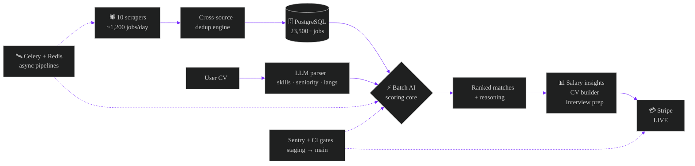

<div align="center">

<!-- ⚡ Custom hand-built animated neural-network header (lives in /assets) -->


<br/><br/>

<a href="https://tyohunt.com"></a>
<a href="https://viralpatelz.com"></a>
<a href="https://instagram.com/viralpatelz"></a>


</div>

<br/>

## `$ system.boot()`

```console
[ 0.000001 ]  KERNEL .......... viral_patel v2026.7 — Helsinki, Finland 🇫🇮
[ 0.000002 ]  ROLE ............ solo founder · full-stack AI engineer
[ 0.000003 ]  MOUNTING ........ /tyohunt ..................... [ LIVE ✓ ]
[ 0.000004 ]  STRIPE .......... live mode, real revenue ...... [ OK ✓ ]
[ 0.000005 ]  AI CORE ......... GPT + Claude, batch-scored ... [ ONLINE ✓ ]
[ 0.000006 ]  EDUCATION ....... B.Eng. AI @ SAMK ............. [ RUNNING ]
[ 0.000007 ]  MISSION ......... first 100 paying customers ... [ EXECUTING ]
[ 0.000008 ]  FAILSAFE ........ "if one way fails, find another"
[ 0.000009 ]  boot complete. nothing is impossible. █
```

<br/>

## `$ tyohunt --architecture`

> **[TyöHunt](https://tyohunt.com)** — an AI employment engine I designed, built and run alone: scrapers → dedup → LLM scoring → matching → payments. Every box below is production code.



<div align="center">

| ⚙️ TELEMETRY | VALUE |
|---|---|
| Jobs indexed | **23,500+** and counting |
| Ingestion rate | **~1,200 / day**, 10 live sources |
| AI matching | LLM-scored, CV-aware, cost-optimized batching |
| Security audit | **A−** — zero exploitable vulns |
| Team size | **1** (me, and an army of AI agents) |

</div>

<br/>

## `$ stack --loadout`

<div align="center">

**🧠 AI & Intelligence**


**⚙️ Engine Room**


**🛰️ Ops & Delivery**


</div>

<br/>

## `$ ls ~/lab` <sub>— open-source AI tooling</sub>

<table align="center">
<tr>
<td width="50%">

### 🔮 [Repo2Prompt](https://github.com/Viralpatelz/Repo2Prompt)
`Python` — Compresses an entire codebase into one LLM-ready context prompt. Feed your repo to any model.

</td>
<td width="50%">

### 🔥 [TokenBurn](https://github.com/Viralpatelz/TokenBurn)
`Python` — Watches your LLM token spend in real time before it watches your wallet burn.

</td>
</tr>
<tr>
<td width="50%">

### 🌲 [AgentTree](https://github.com/Viralpatelz/AgentTree)
`Python` — Experiments in orchestrating trees of AI agents that plan, delegate and verify.

</td>
<td width="50%">

### 🧰 [mcphub-cli](https://github.com/Viralpatelz/mcphub-cli)
`CLI` — Command-line gateway into the Model Context Protocol ecosystem.

</td>
</tr>
</table>

<br/>

## `$ telemetry --live`

<div align="center">


<a href="https://github.com/Viralpatelz"></a>

<!-- 🐍 generated daily by .github/workflows/snake.yml -->


</div>

<br/>

## `$ cat /etc/principles`

```yaml
ship_daily:        "a feature in staging helps no one"
verify_first:      "never claim untested work works — run it, prove it"
ai_is_leverage:    "one founder + agents > a slow team of ten"
cost_awareness:    "every LLM call is a line item — batch it, cache it"
failure_protocol:  "if one way fails, find another. always ship."
```

<div align="center">

<br/>


<sub>⚡ hand-crafted animated SVGs, zero templates · © Viral Patel · Helsinki, Finland</sub>

</div>
